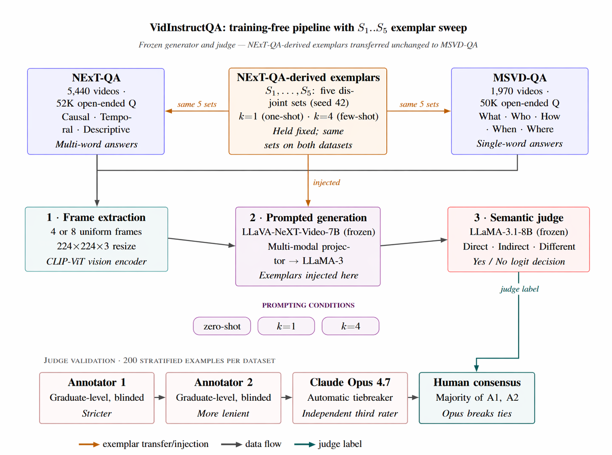

# When One Exemplar Is Not Enough

**Prompt Fragility and Label-Bias in Training-Free Video Question Answering**

[](#citation)
[](LICENSE)
[](https://www.python.org/)
[](https://pytorch.org/)

Official code release for **"When One Exemplar Is Not Enough: Prompt Fragility and Label-Bias in Training-Free Video Question Answering"** by Abdullah Ahmad, Ahmed J.O. Ahmed, and Luca Citi (Department of Computer Science and Electronic Engineering, University of Essex).

This repository releases all prompts, exemplar sets, human annotations, and evaluation code for **VidInstructQA** — a fully training-free Video Question Answering pipeline pairing a frozen LLaVA-NeXT-Video-7B generator with a frozen LLaMA-3.1-8B semantic judge. The work probes a question that the recent training-free VideoQA literature has largely glossed over: **how stable are reported few-shot gains under different exemplar draws?**

---

## Table of contents

1. [Headline findings](#headline-findings)
2. [Methodology](#methodology)
3. [Repository layout](#repository-layout)
4. [Installation](#installation)
5. [Data preparation](#data-preparation)
6. [End-to-end pipeline](#end-to-end-pipeline)
   1. [Step 1 — Frame extraction and dataloader build](#step-1--frame-extraction-and-dataloader-build)
   2. [Step 2 — Prompted generation (LLaVA-NeXT-Video-7B)](#step-2--prompted-generation-llava-next-video-7b)
   3. [Step 3 — Semantic evaluation (LLaMA-3.1-8B judge)](#step-3--semantic-evaluation-llama-31-8b-judge)
   4. [Step 4 — Accuracy aggregation](#step-4--accuracy-aggregation)
7. [Reproducing the paper's tables](#reproducing-the-papers-tables)
8. [Human-annotation protocol](#human-annotation-protocol)
9. [Hardware and runtime](#hardware-and-runtime)
10. [Limitations](#limitations)
11. [Citation](#citation)
12. [License and acknowledgements](#license-and-acknowledgements)

---

## Headline findings

The paper's three findings, summarised:

1. **Exemplar choice dominates prompting condition.** Across five disjoint NExT-QA-derived exemplar sets, one-shot NExT-QA test accuracy ranges from 53.06% to 71.20% (mean 60.99 ± 6.81) — an 18-point swing larger than any mean difference between zero-, one-, and few-shot. Single-set numbers can substantially overstate typical gains; the +16.09-point one-shot lift on NExT-QA reported with a single representative exemplar shrinks to a +5.88 mean across five draws.
2. **A directional cross-dataset effect survives but shrinks.** One-shot mean accuracy beats zero-shot on NExT-QA in 4/4 (split × frame-count) cells and falls below zero-shot on MSVD-QA in 4/4 cells, but at magnitudes of ~6 / ~3 points rather than 16 / 5. At n = 5 the NExT-QA mean lift is not statistically distinguishable from zero-shot (one-sample t = 1.93, p = 0.126).
3. **A label-bias mechanism explains one anomalous spike.** One few-shot set produces an apparent 27-point jump on NExT-QA test (82.22%). On the 200-example validation sample, the LLaMA judge accepts 86% of outputs against a human-consensus rate of 56.5%, driven by a 3:1 Yes/No ratio in the judge's in-context demonstrations versus 1:3 or 2:2 in the other four sets. This is the in-context label-bias effect documented for text-only tasks by Zhao et al. (2021), Min et al. (2022), and Lu et al. (2022), made explicit here in a multi-modal LLM-as-judge VideoQA pipeline.

The takeaway for practitioners: **report mean ± std over a small exemplar sweep rather than single-set numbers, and balance Yes/No verdicts in any LLM-as-judge prompt.**

---

## Methodology



The pipeline has three frozen stages and one controlled axis:

| Stage | Module | Frozen | Role |
| --- | --- | --- | --- |
| 1 | Frame extraction | — | 4 or 8 uniformly sampled frames at 224×224 per video. |
| 2 | LLaVA-NeXT-Video-7B-hf | yes | Generator. Receives the prompt and (optional) k exemplars; emits a free-form natural-language answer. |
| 3 | LLaMA-3.1-8B | yes | Semantic judge. Reads (question, ground truth, generated answer) and emits a binary Yes / No rubric verdict. |

The only controlled variables are:

- **Frame count** ∈ {4, 8}
- **Prompting condition** ∈ {zero-shot, one-shot k = 1, few-shot k = 4}
- **Exemplar set** ∈ {S1, S2, S3, S4, S5} — five disjoint draws from NExT-QA train, seed 42

The same five NExT-QA-derived exemplar sets are transferred unchanged to MSVD-QA, so any cross-dataset effect is a property of the exemplar pool, not of dataset-specific tuning.

---

## Repository layout

```text
When-Few-Shot-Hurts/
├── README.md                          ← this file
├── LICENSE
├── requirements.txt
├── docs/
│   └── methodology.svg                ← pipeline diagram (above)
├── src/
│   ├── frame_extraction.py            ← Step 1: frames + dataloader builder (CLI)
│   ├── Evaluation_pipeline.py         ← Step 3: LLaMA-3.1-8B judge (CLI)
│   ├── next_qa/
│   │   └── inference.py               ← Step 2: LLaVA inference on NExT-QA
│   ├── msvd_qa/
│   │   ├── inference.py               ← Step 2: LLaVA inference on MSVD-QA
│   │   ├── val.json
│   │   └── test.json
│   └── Prompts/
│       ├── LLM_as_judge_base.j2       ← zero-/one-shot judge template
│       ├── LLM_as_judge_few.j2        ← few-shot judge template
│       └── examples/
│           ├── one_shot.json          ← exemplar sets K1..K5 for k = 1
│           └── few_shot.json          ← exemplar sets K1..K5 for k = 4
├── scripts/
│   └── compute_accuracy.py            ← Step 4: overall + per-category accuracy (both datasets)
└── annotations/                       ← (released with the paper) human-annotated 200 × 2 validation samples
```

The exemplar sets in `src/Prompts/examples/` are **K1..K5** in the JSON files; these correspond one-to-one with **S1..S5** in the paper. All 25 exemplars are released verbatim.

---

## Installation

The code targets Python 3.9+ with CUDA 11.8/12.1 and was developed on Linux with 3 × NVIDIA A30 24 GB. Both LLaVA-NeXT-Video-7B and LLaMA-3.1-8B are loaded in 4-bit via `bitsandbytes`, so a single 24 GB GPU is sufficient.

```bash
git clone https://github.com/abuba8/When-Few-Shot-Hurts.git
cd When-Few-Shot-Hurts

# Recommended: use a fresh virtual environment
python -m venv .venv
source .venv/bin/activate   # Windows: .venv\Scripts\activate

pip install --upgrade pip
pip install -r requirements.txt
```

LLaMA-3.1-8B and LLaVA-NeXT-Video-7B are gated on Hugging Face. Request access through their model cards, then either export your token or place it in a `.env` file at the repository root:

```bash
export HF_TOKEN="hf_xxx..."
# ── or ──
echo "HF_TOKEN=hf_xxx..." > .env
```

`requirements.txt` (a representative pin set):

```
torch>=2.1
transformers>=4.42
accelerate>=0.30
bitsandbytes>=0.43
sentencepiece
opencv-python
pandas
pyarrow
numpy
tqdm
matplotlib
sentence-transformers
scikit-learn
evaluate
bert_score
huggingface-hub
python-dotenv
jinja2
```

---

## Data preparation

Both benchmarks are publicly available. Place them outside the repository (the scripts use relative paths like `../NExTQA/`):

- **NExT-QA**. Download the open-ended split from the [official release](https://github.com/doc-doc/NExT-QA). The expected layout:
  ```
  NExTQA/
  ├── OE/
  │   ├── train-00000-of-00001.parquet
  │   ├── validation-00000-of-00001.parquet
  │   └── test-00000-of-00001.parquet
  └── videos/
      └── *.mp4
  ```
- **MSVD-QA**. Download from the [MSVD-QA repository](https://github.com/xudejing/video-question-answering). The metadata in `src/msvd_qa/{val,test}.json` already follows the `{file_name, question, answer, video_id, id}` schema used by the inference script.

---

## End-to-end pipeline

The full evaluation grid in Table 1 of the paper has 80 cells (2 datasets × 2 splits × 2 frame counts × 2 prompting conditions × 5 exemplar sets). Below is the recipe for one cell; loop over the axes you care about.

### Step 1 — Frame extraction and dataloader build

The `frame_extraction.py` script is a single CLI with three subcommands:

#### 1a · `extract` — sample frames from videos into per-batch pickles

```bash
python src/frame_extraction.py extract \
    --dataset    nextqa \
    --metadata   ../NExTQA/OE/validation-00000-of-00001.parquet \
    --video-dir  ../NExTQA/videos/ \
    --split      val \
    --n-frames   4 \
    --batch-size 50 \
    --out-dir    ../extracted_feats
```

Each output pickle (`../extracted_feats/val/4_frames/full_feats_val/{i}.pkl`) is a dict of up to `--batch-size` samples; every sample carries the four keys consumed downstream — `video_frames`, `question`, `answer`, `type` — so the per-batch pickles are themselves valid dataloader fragments and an interrupted run only has to redo the unfinished tail.

For MSVD-QA, point `--metadata` at the JSON instead and pass `--dataset msvd`. MSVD-QA does not store a question-type field, so the script infers a coarse What / Who / How / When / Where category from the question's first word — sufficient for the per-category accuracy reported in `results_msvq_2.py`.

#### 1b · `merge` — concatenate batches into a single dataloader pickle

```bash
python src/frame_extraction.py merge \
    --in-dir   ../extracted_feats/val/4_frames/full_feats_val \
    --out-file ../data_loaders/val/4_frames/dataloader_val_4_frames_1.pkl \
    --start    1 \
    --end      41
```

`merge` re-keys samples with consecutive integers from 1 (the order the inference scripts iterate) and silently drops malformed rows (empty question, missing frames). The summary printout reports raw / valid / invalid counts so corrupted videos are visible.

For very large splits (e.g. NExT-QA `train`) it is convenient to write several dataloader pickles by repeating `merge` over disjoint `--start`..`--end` ranges and shard inference across GPUs — this is what we did to fit the full grid into a single workstation.

#### 1c · `preview` — visual sanity check

```bash
python src/frame_extraction.py preview \
    --in-file     ../data_loaders/val/4_frames/dataloader_val_4_frames_1.pkl \
    --sample-index 1
```

Opens a matplotlib figure with the four (or eight) sampled frames laid out left-to-right and prints the question, ground-truth answer, and category of the chosen sample.

### Step 2 — Prompted generation (LLaVA-NeXT-Video-7B)

The two inference entry points are organised by dataset because the input formats differ — NExT-QA reads from a frame-bundled pickle, MSVD-QA reads videos at runtime — but they share the same model build, deterministic decoding, and resume-from-checkpoint behaviour.

#### 2a · NExT-QA

```bash
python src/next_qa/inference.py \
    --input  ../data_loaders/val/4_frames/dataloader_val_4_frames_1.pkl \
    --output outputs/nextqa/val_4f_zero.json \
    --max-new-tokens 200 \
    --checkpoint-every 10 \
    --resume
```

Output is a JSON dictionary keyed by sample index, with the fields the judge consumes in the next step:

```json
{
  "1": {
    "Question": "...",
    "Original Answer": "...",
    "Generated Answer": "...",
    "Similarity Score": 0.71,
    "BERTScore": 0.86
  }
}
```

`Similarity Score` (sentence-transformers cosine) and `BERTScore` are reported for transparency; the paper's accuracy numbers come from the LLaMA judge at Step 3, since surface metrics fail systematically when the ground truth is a 1–5-word phrase and the VLM emits a multi-sentence answer.

#### 2b · MSVD-QA

```bash
python src/msvd_qa/inference.py \
    --video_dir ../MSVD-QA/videos/ \
    --data_file src/msvd_qa/val.json \
    --output    outputs/msvd/val_4f_zero.json \
    --split     val \
    --n_frames  4 \
    --max-new-tokens 200 \
    --checkpoint-every 10 \
    --resume
```

The MSVD-QA script samples frames lazily on a per-video basis (no pickled dataloader), which is fine because MSVD clips are short (typically < 10 s). For consistent ablation runs, pre-extract once with `frame_extraction.py extract --dataset msvd` and adapt the loader, but for single-cell runs the on-the-fly path is simpler.

Both inference scripts are deterministic (`do_sample=False`) — the greedy output of a given (model, frames, prompt) triple is reproducible bit-for-bit, which is what makes the validation-sample analysis in §4.3 of the paper possible.

#### Switching prompting conditions

The Step 2 scripts produce **zero-shot** outputs. To run **one-shot** or **few-shot**, edit `build_prompt()` in either `inference.py` to inject a `K{i}` exemplar from `src/Prompts/examples/{one,few}_shot.json` into the user content. The exemplar JSON is shipped with the repo so this stays a one-line change; the prompts and the judge templates use the same `K1..K5` namespace so the same selector controls both stages.

### Step 3 — Semantic evaluation (LLaMA-3.1-8B judge)

```bash
python src/Evaluation_pipeline.py \
    outputs/nextqa/val_4f_zero.json \
    outputs/nextqa/val_4f_zero_judged.json \
    --shot-type few \
    --k         K3 \
    --model     meta-llama/Meta-Llama-3.1-8B
```

Arguments:

- `input_json`, `output_json` — positional. The output file is the input plus a `Similarity` field per entry, which is exactly the field the Step 4 aggregators look for.
- `--shot-type` ∈ {zero, one, few}. Selects the rubric template (`Prompts/LLM_as_judge_base.j2` or `Prompts/LLM_as_judge_few.j2`).
- `--k` — the exemplar set used inside the judge prompt (`K1`..`K5`). The exemplar file is the same one consumed at Step 2; the same `--k` should be used at both steps for the cell to correspond to a paper row.
- `--hf-token` defaults to `$HF_TOKEN`.

The judge runs in 4-bit `nf4` quantisation with double quantisation. The decision token is the higher-probability logit between `Yes` and `No`; non-Yes/No tokens are treated as `No` under the conservative policy reported in §3.4 of the paper.

### Step 4 — Accuracy aggregation

`scripts/compute_accuracy.py` is a single CLI that handles both datasets. It accepts one or more judge JSONs (sharded inference runs are merged with file-index suffixes on key collisions) and reports overall accuracy plus a per-category breakdown matched to the dataset.

#### NExT-QA — overall + fine-grained type + broad category

The NExT-QA breakdown pulls each entry's type code (CW / CH / TN / TC / TP / DC / DL / DO / DB) from the parquet by matching on the question text, then groups them into Causal / Temporal / Descriptive.

```bash
python scripts/compute_accuracy.py nextqa \
    outputs/nextqa/val_4f_zero_judged.json \
    --parquet ../NExTQA/OE/validation-00000-of-00001.parquet
```

#### MSVD-QA — overall + per-Wh-word breakdown

MSVD-QA does not store a question-type field, so the breakdown is inferred from the question's first word (What / Who / How / When / Where) — the same convention used by `frame_extraction.py` when building the MSVD dataloader.

```bash
python scripts/compute_accuracy.py msvd outputs/msvd/val_4f_zero_judged.json
```

Pass `--no-breakdown` for either dataset to print overall accuracy only, and pass multiple JSON paths positionally to merge sharded runs:

```bash
python scripts/compute_accuracy.py msvd \
    outputs/msvd/val_4f_zero_shard1.json \
    outputs/msvd/val_4f_zero_shard2.json \
    --no-breakdown
```

---

## Reproducing the paper's tables

Table 1 in the paper (80 cells) is produced by running the four-step pipeline above for every combination of (dataset, split, frame count, condition, set):

```text
datasets       = {NExT-QA, MSVD-QA}
splits         = {val, test}
frames         = {4, 8}
conditions     = {zero, one, few}     # zero is run once per (dataset, split, frames)
sets           = {K1, K2, K3, K4, K5} # exemplar sets, paper labels S1..S5
```

Two practical notes:

- Step 2 (LLaVA generation) only depends on the **generator-side** exemplar; varying the **judge-side** exemplar at Step 3 reuses the same Step-2 outputs. This is the cost-asymmetry the validation-sample analysis exploits in Finding 3.
- On the 200-example stratified validation sample, greedy decoding makes the Step-2 outputs identical across prompting conditions, so any condition-dependent variation observed there is a judge-side effect. This is what isolates the label-bias mechanism diagnosed in §4.3.

A reproducer shell loop is provided in `scripts/run_grid.sh`. Adapt the GPU IDs and paths before running.

---

## Human-annotation protocol

Two graduate-level annotators (A1 stricter, A2 more lenient), both blinded to judge decisions, independently labelled 200 stratified test examples per dataset under the three-class rubric (Direct Match / Indirect Context / Different Context, collapsed to Yes / No). Where A1 and A2 disagreed, **Claude Opus 4.7** was used as an automatic, independent third rater under the same rubric to break ties.

Inter-annotator agreement was substantial on both datasets:

| Dataset | A1 vs A2 (raw) | A1 vs A2 (κ) | Opus vs A1 (κ) | Opus vs A2 (κ) |
| --- | --- | --- | --- | --- |
| NExT-QA | 85.00% | 0.693 | 0.571 | 0.791 |
| MSVD-QA | 86.00% | 0.695 | 0.550 | 0.691 |

Opus broke 30/200 ties on NExT-QA and 28/200 on MSVD-QA, siding with the more lenient annotator (A2) more often than A1 in both datasets. The full annotation files, including per-example A1/A2/Opus labels, are released under `annotations/` so that the κ numbers above are directly recomputable.

---

## Limitations

The findings are framed conservatively in §7 of the paper, but for completeness:

- **n = 5 is a first-order variance estimate, not a confidence interval.** The within-condition std is 5.6–12.0 points; the NExT-QA one-shot lift over zero-shot at n = 5 is +5.88 with t = 1.93, p = 0.126.
- **Judge agreement is fair, not substantial.** κ = 0.24–0.36 on the LLaMA judge versus κ ≈ 0.69 between human annotators. Absolute accuracies should be read as relative comparisons across cells.
- **Label-bias dose-response is descriptive at this sample size.** Pearson r between Yes-fraction in the judge demonstrations and judge Yes-rate is 0.76 (NExT-QA) / 0.79 (MSVD-QA) at n = 4 — directionally clear, not statistically conclusive. A deliberate Yes-fraction sweep is the natural follow-up.
- **One backbone, two datasets.** Effects under LLaVA-NeXT-Video-7B + LLaMA-3.1-8B may not transfer to larger or better-calibrated judges. Stronger judges (e.g. GPT-4) would plausibly attenuate Finding 3 but, given the Wang/Chiang evidence on LLM-judge bias, are unlikely to eliminate it.
- **MSVD-QA validation under-represents How (n = 6) and When (n = 1) and contains no Where.** Minority-category κ values should not be over-interpreted.

---

## License and acknowledgements

This work uses the following pre-trained models and datasets, each governed by their own licenses:

- [LLaVA-NeXT-Video-7B-hf](https://huggingface.co/llava-hf/LLaVA-NeXT-Video-7B-hf) (Liu et al., 2024)
- [Meta-Llama-3.1-8B](https://huggingface.co/meta-llama/Meta-Llama-3.1-8B) (Meta AI, 2024) — Llama 3.1 Community License
- [NExT-QA](https://github.com/doc-doc/NExT-QA) (Xiao et al., CVPR 2021)
- [MSVD-QA](https://github.com/xudejing/video-question-answering) (Xu et al., ACM MM 2017)